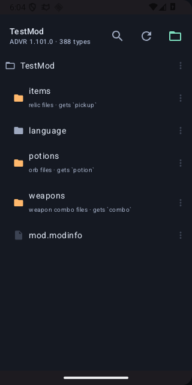
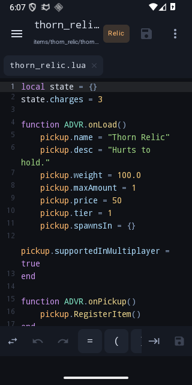
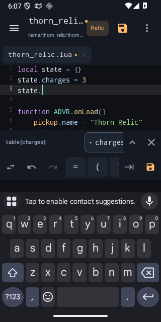
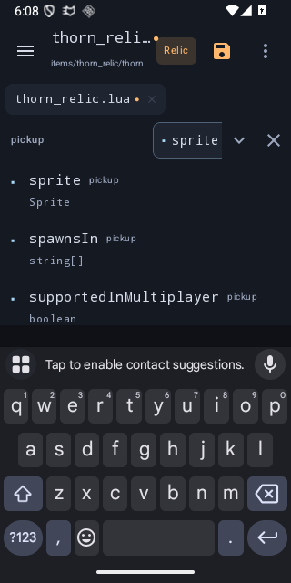
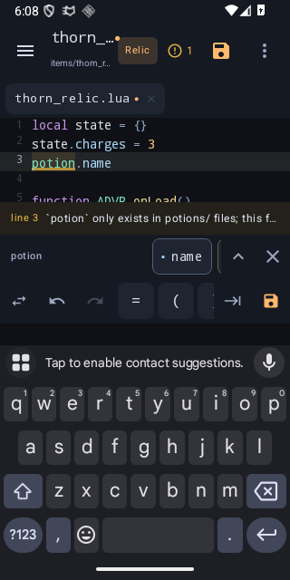

# ADVR Lua

[](../../actions/workflows/ci.yml)
[](LICENSE)
[](#building)

An Android editor for writing **Ancient Dungeon VR** mods in Lua, built around the same API
definitions the desktop [ADVR Modding Tools][ext] extension ships.

Everything the editor knows about the game is generated from that extension's Lua definition stubs
and bundled into the APK — **388 classes, 12,065 fields, 20,256 methods across 41,471 overloads** —
so completion, signature help and linting all work offline with no language server.

> Unofficial and community-built. Not affiliated with or endorsed by ErThu Games GmbH.

| Workspace | Editor | Custom objects |
| --- | --- | --- |
|  |  |  |

| ADVR API | Per-file globals |
| --- | --- |
|  |  |

## What it does

### Completion that understands ADVR

- Every type in the stub library, with real parameter names, types and return types.
- Typing `pickup.` lists that relic's actual fields; `game.GetLocalPlayer().` follows the declared
  return type into the next type.
- Overloads are all kept, and a signature strip shows the parameter your caret is on.

### Custom objects, live

The open file is re-analyzed as you type, so tables you build are completable immediately:

```lua
local state = {}
state.charges = 3
state.owner   = "player"
state.        --> charges, owner
```

Table literals, nested tables (`mod.stats.damage = 12`), functions attached to a table
(`function helper.reset(n)`), `ipairs`/`pairs` loop variables, and hand-written `---@class` /
`---@type` annotations all feed the same inference.

### Per-file globals

ADVR runs each mod Lua file in its own environment. The editor models that directly:

- A file under `items/` is offered `pickup`; `potion`, `progress` and the rest never appear.
- `ADVR.` offers only the event table that folder owns — `PotionEvents` in `potions/`,
  `WeaponComboEvents` in `weapons/`.
- Globals you assign are offered in that file and nowhere else.
- `CallFunctionIn("name")` is checked against functions in the *same* file, because that is all it
  can reach.

### Problems

Missing required callbacks for the folder (`ADVR.PotionEvents.onPotionRunOut` in `potions/`),
callbacks that belong to a different folder, per-file globals borrowed from another kind of file,
identifiers that are never bound, likely typos on the file's own global
(``pickup.nmae`` → did you mean `name`?), and unbalanced blocks.

### Built for a phone

- A key row for the characters Lua needs that phone keyboards bury: `= ( ) { } [ ] " ' .. ~= #`,
  a Lua keyword row, and caret keys so you never drag a text handle to fix one character.
- Suggestions ride directly above the keyboard as a scrolling strip; expand for types and docs.
- Enter keeps your indentation and opens a level after `then` / `do` / `)`; typing `end` pulls back.
- Brackets and quotes close themselves and step over.
- Tabs render as real indentation — Android otherwise lays them out on 20px stops — without touching
  the bytes on disk.
- Soft wrap with a gutter that keeps one number per logical line.

### Workspace

The whole mod folder, opened through the Storage Access Framework, so the app needs no broad storage
permission. Browse, open several files as tabs, create, rename, delete, and search across the
workspace. Folders ADVR treats specially are labelled with the kind of file they hold, and new files
created in them start from the right template.

## Building

Requires **JDK 17** and an Android SDK with **platform 36**. The build finds the SDK through
`$ANDROID_HOME` or `$ANDROID_SDK_ROOT`; to point at it explicitly instead, create a `local.properties`
containing `sdk.dir=/path/to/Android/Sdk` (that file is not tracked).

```sh
./gradlew assembleDebug
adb install -r app/build/outputs/apk/debug/app-debug.apk
```

Tests run on the JVM against the real generated index, not fixtures:

```sh
./gradlew testDebugUnitTest
```

Minimum supported device is Android 8.0 (API 26).

## Updating the API for a new ADVR release

`app/src/main/assets/advr_api.txt` is **generated — never edit it by hand**. After the
[ADVR Modding Tools][ext] extension updates, regenerate it:

```sh
python3 tools/gen_api_index.py
```

The script locates the installed extension itself (VS Code, VS Codium, code-server, Cursor,
Windsurf) and prints what it found. To point at a checkout explicitly:

```sh
python3 tools/gen_api_index.py path/to/lua-definitions/library [output]
```

The output is a line-oriented table — 3.8 MiB of text, about 350 KiB once the APK deflates it — that
the app parses on a background thread at startup.

## Layout

| Path | What lives there |
| --- | --- |
| `tools/gen_api_index.py` | Parses the LuaLS stubs into the bundled index |
| `api/ApiIndex.kt` | Loads the index; class/field/method lookup with inheritance |
| `api/ModContext.kt` | Folder → mod kind → which globals and callbacks a file gets |
| `lua/LuaLexer.kt` | Single-pass Lua scanner shared by highlighting and analysis |
| `lua/LuaAnalyzer.kt` | Scope stack and type inference over the file being edited |
| `lua/TypeResolver.kt` | One implementation of "what members does this type have?" |
| `lua/Completion.kt` | Ranking, member chains, signature help |
| `lua/Diagnostics.kt` | The folder-aware checks |
| `lua/EditAssist.kt` | Indent, bracket closing, comment toggling |
| `ui/` | Compose editor surface, key bar, explorer, sheets |
| `data/` | SAF workspace, buffers, undo, view model |

Kotlin sources live under `app/src/main/java/com/advr/luaeditor/`. Everything in `lua/` is free of
Android dependencies, which is what makes it testable on the JVM.

## Contributing

See [CONTRIBUTING.md](CONTRIBUTING.md).

## License

[MIT](LICENSE).

The bundled API index is derived from the ADVR Modding Tools extension and redistributed under its
own MIT license — see [THIRD_PARTY_NOTICES.md](THIRD_PARTY_NOTICES.md).

[ext]: https://marketplace.visualstudio.com/items?itemName=erthugames.advr-modding-tools
